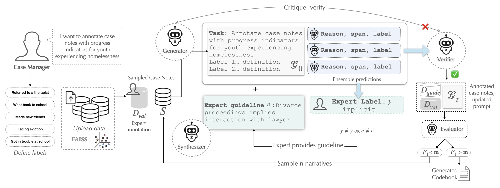

# Agentic Framework for LM-Assisted Annotation (mosaic)

Run:
pip install streamlit requests
Keep `ollama serve` running 
streamlit run app.py --server.address 127.0.0.1

- Files:
  - `environment.yml` conda requirements
  - `app.py` main entry point
  - `screens/` per-screen UI modules
  - `services/` API wrappers (Ollama)
  - `utils/` data helpers
  - `assets/style.css` CSS

## Overview
[🌐 Website](https://mosaic-ai-spotlight.lovable.app/)

President Trump’s FY 2026 budget proposes slashing **$532 million** from Homeless Assistance Grants and cutting HUD programs by about **44%**, putting tens of thousands of housing units and services at risk.  
The **National Alliance to End Homelessness** estimates that eliminating HUD’s Continuum of Care program could disrupt **170,000 permanent supportive housing units** and increase the national homeless population by **36%**.

At the same time, a survey of homeless case managers found that **55%** of full-time workers in frontline roles currently earn under **$55,000**, raising the risk of turnover.  
In the broader nonprofit space, **95%** of nonprofit leaders report concerns about staff burnout, and nearly **50%** say they struggle to fill vacancies.

The result?  
Case managers are being asked to carry higher caseloads with fewer housing options, less flexible programming, and increased pressure to triage clients.  
Burnout, turnover, and service breakdowns will no longer be exceptions—they will be the default.

---

## Problem

> “There is too much data to manually extract useful, large-scale insights from it. It feels like there’s 300 different tasks I have to manage on a daily basis and note-taking is not my top priority.”

Case managers face **information overload** from documentation and data entry.  
They rely on *codebooks* to:

- Define progress metrics for youth experiencing homelessness  
- Extract progress metrics from case notes  

The **codebook** contains labels and their definitions.  
However, manually extracting these progress metrics from case notes is **time-consuming** and cannot scale.  
Insights remain trapped in isolated spreadsheets and notes, making strategic decision-making slow or impossible—directly impacting people experiencing homelessness.

Unfortunately, existing tools fall short.

### Limitations of Current Tools

Platforms like **CaseWorthy**, **CiviCore**, **Casebook**, **Google Docs**, and **VI-SPDAT** create **data silos** and **redundant documentation**, forcing case managers to re-enter information across disconnected systems.  
With limited analytics or insight generation, they often feel more like **data clerks** than social workers.

---

## Solution

We propose an **Agentic Framework for LM-assisted Codebook Development** that learns directly from expert reasoning across client interactions.

Our system dynamically captures how case managers interpret client stories, codifies those insights into shared guidelines, and automatically applies them to future cases.

By transforming unstructured notes and assessments into a **living, organization-specific knowledge base**, the system:

- Reduces redundant data entry  
- Standardizes triage decisions  
- Preserves institutional knowledge  
- Enables case managers to spend less time on paperwork and more time helping people  

---

<figure align="center">
  
  <figcaption><b>Figure 1.</b> Our system introduces a human-in-the-loop algorithm where experts iteratively refine labeling guidelines with the help of specialized agents. A Generator produces initial annotations and rationales for sampled case notes based on an initial prompt. We ensemble predictions based on majority voting and a Verifier applies confidence-based abstention to flag uncertain or incorrect labels, and verifies whether the span and chain of thought reasoning are in accordance with the codebook. Experts review only these flagged cases, providing corrected labels and short rationales, which the Synthesizer integrates into an updated prompt (guideline). The Evaluator periodically measures performance on held-out expert data; if the F₁ score exceeds a target threshold, the process stops. This agentified loop, generate, verify, synthesize, and evaluate, efficiently converts expert feedback into refined annotation guidelines, reducing manual codebook development from weeks to hours. This allows case managers to efficiently characterize progress metrics for their clients, enabling data-driven decision-making and more targeted interventions. </figcaption>
</figure>

## How It Works

### Agentic Framework for LM-Assisted Codebook Development

Our system introduces a **human-in-the-loop algorithm** where experts iteratively refine labeling guidelines with the help of specialized agents:

1. **Generator** → Produces initial annotations and rationales for sampled case notes based on an initial prompt.  
2. **Verifier** → Applies ensemble prediction and **confidence-based abstention** to flag uncertain or incorrect labels, verifying whether the reasoning and spans align with the codebook.  
3. **Expert Review** → Experts only review flagged cases, providing corrected labels and short rationales.  
4. **Synthesizer** → Integrates expert rationales into updated prompts (guidelines).  
5. **Evaluator** → Periodically measures performance on held-out expert data.  
   - If the F₁ score exceeds a target threshold, the process stops.  

This **agentified loop — generate, verify, synthesize, and evaluate —** efficiently converts expert feedback into refined annotation guidelines, reducing manual codebook development from **weeks to hours**.

This allows case managers to efficiently characterize progress metrics for their clients, enabling **data-driven decision-making** and more **targeted interventions**.

---

## Novelty

> [arXiv:2508.18541](https://arxiv.org/abs/2508.18541)

---

### Potential for TAM Expansion

Beyond homelessness services, this system can be adapted for other domains requiring human-guided text interpretation, such as:

- **Suicide Death Narrative Data Abstraction**  
- **Identifying Illegal Wildlife Trafficking on Social Media**  
- **Defining Attitudes Toward People Experiencing Homelessness**  
- **Abstracting Health Record Data**

---